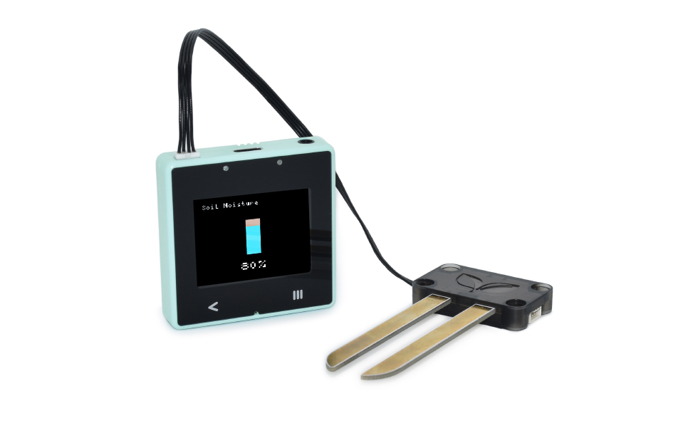
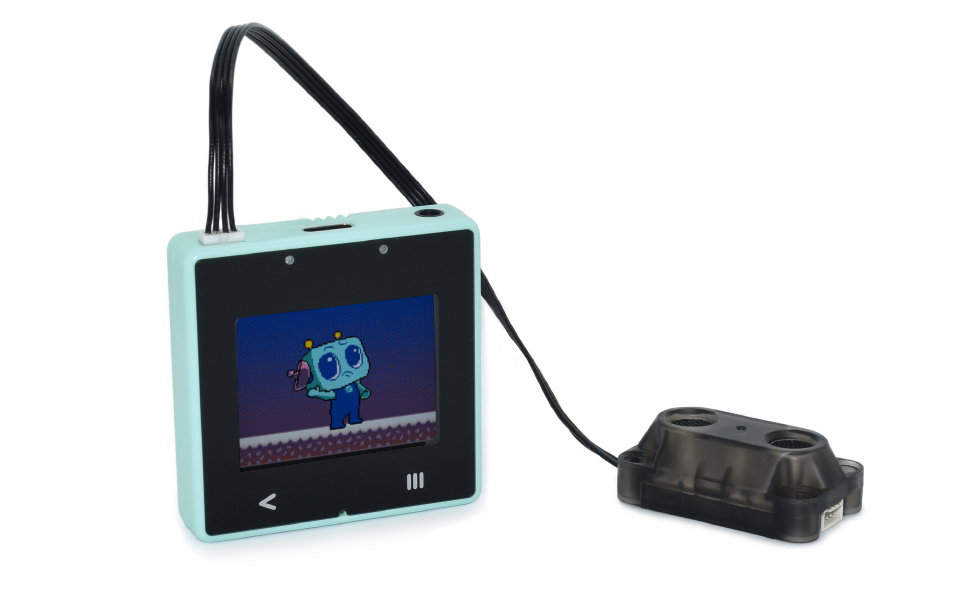
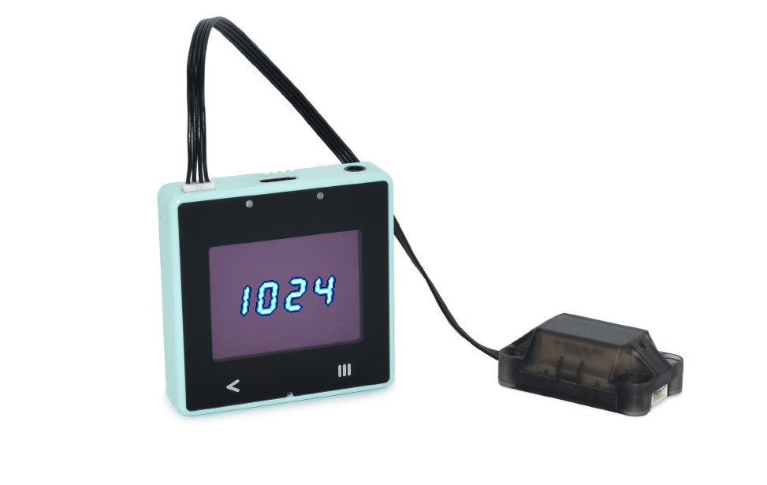
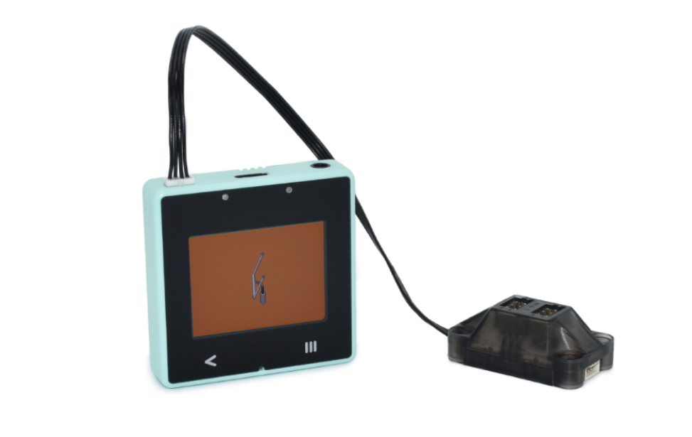
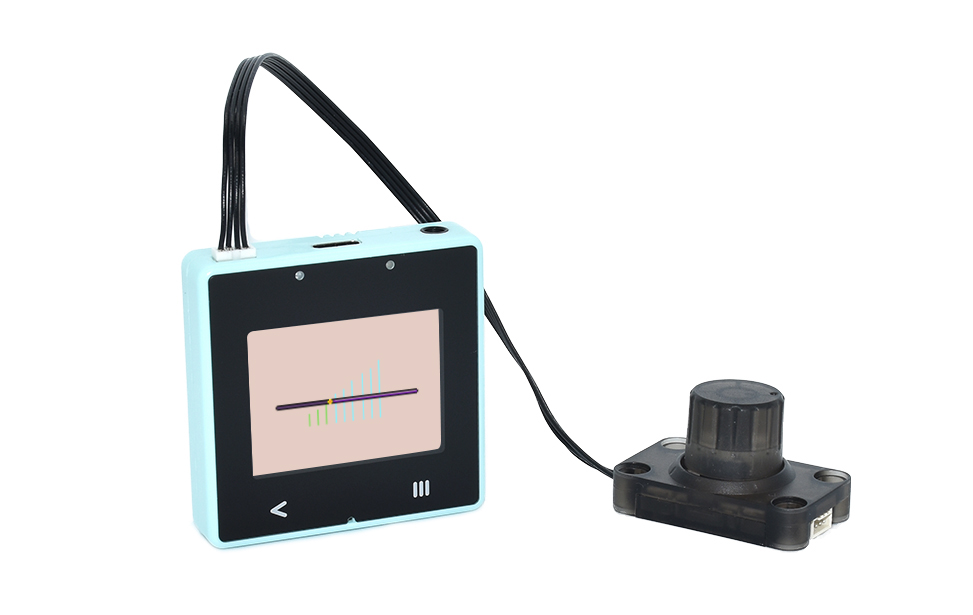
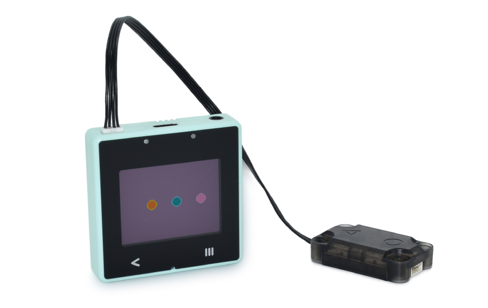

## Extensions

Xtron Pro supports following modules:

- Soil moisture sensor module
- Ultrasonic module
- 7 segment display module
- Servo controller module
- Potentiometer module
- Touch & led module

### Soil moisture sensor module

Use this module to detect your plant soil moisture, you can display it on the screen or 7-segment display module, you can also report it to server, and monitor it remotely through our IoT App Xconsole.

### Ultrasonic module

Consisted of an ultrasonic sensor and a loudness sensor, you can use it to detect obstacles, measure distances and read loudness.

### 7 segment display module

This module is consisted of a 7-segment display, temperature and humidity sersors, you can display numbers like traffic light counter with it, you can also read temperature and humidity of the air from it.

### Servo controller module

You can use it to control servo motors, it has 4 ouput ports, so you can connect 4 servo motors to one module at the same time, but please keep in mind that Xtron Pro's current output capacity is limited, so if you want to use it to control a high-torque servo, you need to connet an external power supply to the module.

It supports 9g servo motor with 2.54mm pitch plug by default.

### Potentiometer module

Potentiometer is an input module, you can read the value of it in your program, it's value range is from 0 to 100, so you can use it to control light brightness, servo motor angle or dc motor strength, etc.

### Touch & led module

Touch & Led module has 8 RGB Leds and 2 touch input pads, you can program it to flash colorful lights, run light animations and read touch input. You can even make a touch control light with this single module.
