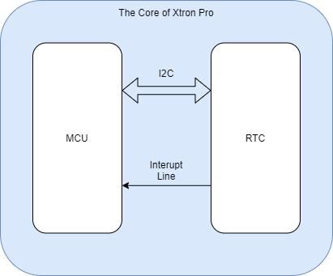

# Xtron Pro features

Xtron Pro has many hardware resources available for programming, you can use these hardware resources to make games, create a watch, or do some creative projects.

## MakeCode Arcade

Xtron Pro was born for MakeCode Arcade platform, which is a famous retro game editor usding Blocks, Javascipt and Python language. It is very suitable for children to learn programming, there are many tutorials and skillmaps for getting started. Of course, it is also suitable for some game lovers and makers who want to make their own games.

You can run the MakeCode Arcade games on the simulator, it is very covenient when you are deceloping a game, you can get responce and optimize your program immediately. You can share your game when you have completed it.

Xtron Pro offers many hardware resources for you to make a game, you can use the IMU sensor to make a gravity sensing game, or connect two Xtron Pros to develop a multiplayer game, and it is ideal for running MakeCode Arcade games.

## Magnetic Modular Design

* 竖屏飞机大战
* 俄罗斯方块

## Store Multiple Apps

## Built-in IMU Sensor

* 体感游戏

## Real Time Clock

Xtron Pro is built-in a real-time clock (RTC) ic, which is a low power clock/date device with a programmable time-of-day alarm and a programmable interupt output.

The RTC ic is connected to the mcu of Xtron Pro with I2C bus and a interupt line. The mcu can communicate with the ic through the i2c bus, and the interupt line is for alarm use.

With the RTC function, You can make a watch application to run on the Xtron Pro. Once you calibrate the time, it will run even if you turn off the device.

You can import [pxt-xtronpro-rtc](pxt-extensions.md) extension to MakeCode Arcade to add a RTC catogory in the toolbox, it has a bunch of blocks for real-time clock.

Learn more about [Real Time Clock](real-time-clock.md)

## Wi-Fi Module

## IoT

## Speech Recognition

## Expansions

## Emulator

## Micropython