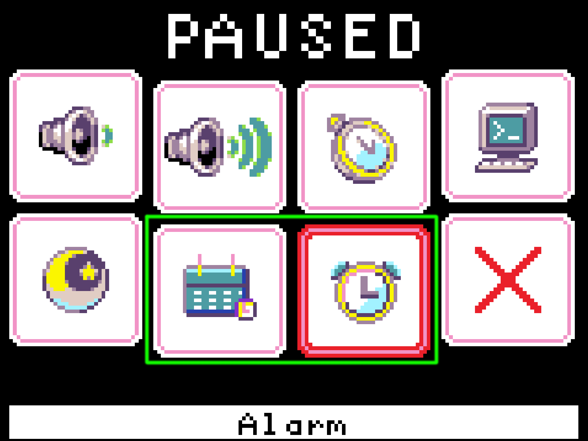

# Extensions for MakeCode Arcade

Extensions are MakeCode dynamic/static library mechanism for extending a target, such as the pxt-arcade. Xtron Pro has many features that MakeCode Arcade don't support by default, so you should load a specific extension when you need that feature.

## Use the Extension

The extension can be added to MakeCode Arcade.

* open [https://arcade.makecode.com/](https://arcade.makecode.com/)
* click on **New Project**
* click on **Extensions** under the gearwheel menu
* search for **github repository link of the extension** and import

## ``pxt-xtronpro-util``

As the name says, this extension has a bunch of utilities for Xtron Pro, includes additional buttons and step counter. This extention will add two more button options (C and start) to on [A] button [pressed] and is [A] button pressed blocks and a steps block in the **Extra** section under the **Controller** category in the toolbox.

Import this extension with the URL:

> [https://github.com/tsunyi/pxt-xtronpro-util](https://github.com/tsunyi/pxt-xtronpro-util)

Learn more about [pxt-xtronpro-util]

## ``pxt-xtronpro-rtc``

This extension is for Xtron Pro's real-time clock function, which is a low power clock/date device with a programmable time-of-day alarm and a programmable interupt output.

This extension has a bunch of blocks for real-time clock, including blocks to get/set time and alarm. This extension will add a new category called RTC in the toolbox and and add two menus for setting the time and alarm in the menu interface.

Github repository link: [https://github.com/tsunyi/pxt-xtronpro-rtc](https://github.com/tsunyi/pxt-xtronpro-rtc)

Learn more about [pxt-xtronpro-rtc](real-time-clock.md)