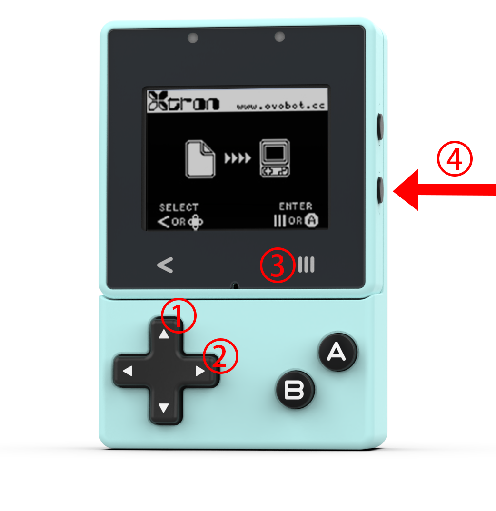

# Common Asked Questions

## Use the NES emulator

Xtron Pro currently can only run the NES emulator, we are working on its new features, including running more simulators, micropython and tensorflow, etc.

[More](https://www.ovobot.cc/en/weblog/2021/02/22/nes-emulator-xtron-pro/)

## Update the bootloader firmware

## Format the Device Intenal Storage

Press the up (1), right (2), menu (3) buttons as shown in the figure below at the same time, and then press the reset (4) button, the green light will keep flashing during the formatting process, which will last about 30 seconds.

After the format is complete, the green light stops flashing, and the bootloader home interface will be displayed.

