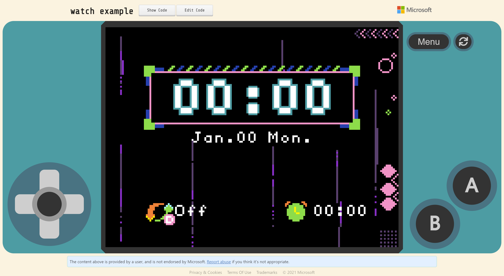

# Real Time Clock

The real-time clock is one of the main functions of Xtron Pro. Xtron Pro is composed of the core and the gamepad, the core can work as a watch with a silicone case. With the real-time clock function, you can write basic clock applications.

The real-time clodk is a low power clock/date device with a programmable time-of-day alarm and a programmable interupt output. To use of the RTC function, first you should import [pxt-xtronpro-rtc](pxt-extensions.md) extension to MakeCode Arcade, whitch will add a RTC catogory in the toolbox.

## API

### time

Returns the selected item of the time in decimal number.

[Learn More](https://arcade.makecode.com/---docs?md=%23%20time%0A%0AReturns%20the%20selected%20item%20of%20the%20time%20in%20decimal%20number.%0A%0A%7C%20Item%20%7C%20Range%20%7C%0A%7C%20----%20%7C%20-----%20%7C%0A%7C%20second%20%7C%200%20to%2059%20%7C%0A%7C%20minute%20%7C%200%20to%2059%20%7C%0A%7C%20hour%20%20%20%7C%200%20to%2023%20%7C%0A%7C%20weekday%20%7C%201%20to%207%2C%20where%20Monday%20is%201%20and%20Sunday%20is%207.%20%7C%0A%7C%20day%20%20%20%20%7C%20Between%201%20and%20the%20number%20of%20days%20in%20the%20given%20month%20of%20the%20given%20year.%20%7C%0A%7C%20month%20%20%7C%201%20to%2012%20%7C%0A%7C%20year%20%20%20%7C%200%20to%2099%2C%20without%20century.%20%7C%0A%0A%60%60%60blocks%0Alet%20y%20%3D%200%0Alet%20x%20%3D%200%0Alet%20picture%20%3D%20image.create(160%2C%20120)%0Apicture.fill(0)%0Ascene.setBackgroundImage(picture)%0Alet%20mySprite%20%3D%20sprites.create(img%60%0A%20%20%20%20.%20.%20.%20.%20.%20.%20.%20.%20.%20.%20.%20.%20.%20.%20.%20.%20%0A%20%20%20%20.%20.%20.%20.%20.%20.%20.%20.%20.%20.%20.%20.%20.%20.%20.%20.%20%0A%20%20%20%20.%20.%20.%20.%20.%20.%20.%20.%20.%20b%205%205%20b%20.%20.%20.%20%0A%20%20%20%20.%20.%20.%20.%20.%20.%20b%20b%20b%20b%20b%20b%20.%20.%20.%20.%20%0A%20%20%20%20.%20.%20.%20.%20.%20b%20b%205%205%205%205%205%20b%20.%20.%20.%20%0A%20%20%20%20.%20b%20b%20b%20b%20b%205%205%205%205%205%205%205%20b%20.%20.%20%0A%20%20%20%20.%20b%20d%205%20b%205%205%205%205%205%205%205%205%20b%20.%20.%20%0A%20%20%20%20.%20.%20b%205%205%20b%205%20d%201%20f%205%20d%204%20f%20.%20.%20%0A%20%20%20%20.%20.%20b%20d%205%205%20b%201%20f%20f%205%204%204%20c%20.%20.%20%0A%20%20%20%20b%20b%20d%20b%205%205%205%20d%20f%20b%204%204%204%204%20b%20.%20%0A%20%20%20%20b%20d%20d%20c%20d%205%205%20b%205%204%204%204%204%204%204%20b%20%0A%20%20%20%20c%20d%20d%20d%20c%20c%20b%205%205%205%205%205%205%205%20b%20.%20%0A%20%20%20%20c%20b%20d%20d%20d%20d%20d%205%205%205%205%205%205%205%20b%20.%20%0A%20%20%20%20.%20c%20d%20d%20d%20d%20d%20d%205%205%205%205%205%20d%20b%20.%20%0A%20%20%20%20.%20.%20c%20b%20d%20d%20d%20d%20d%205%205%205%20b%20b%20.%20.%20%0A%20%20%20%20.%20.%20.%20c%20c%20c%20c%20c%20c%20c%20c%20b%20b%20.%20.%20.%20%0A%20%20%20%20%60%2C%20SpriteKind.Player)%0Agame.onUpdate(function%20()%20%7B%0A%20%20%20%20x%20%3D%2080%20%2B%2050%20*%20Math.sin(rtc.time(TimeItem.SECOND)%20*%200.1047)%0A%20%20%20%20y%20%3D%2060%20-%2050%20*%20Math.cos(rtc.time(TimeItem.SECOND)%20*%200.1047)%0A%20%20%20%20mySprite.setPosition(x%2C%20y)%0A%20%20%20%20picture.fill(0)%0A%20%20%20%20picture.drawLine(80%2C%2060%2C%20x%2C%20y%2C%209)%0A%7D)%0A%60%60%60%0A%0A%60%60%60package%0Artc%3Dgithub%3Atsunyi%2Fpxt-xtronpro-rtc%0A%60%60%60)

### stringFormatTime

Get time in string format.

[Learn More](https://arcade.makecode.com/---docs?md=%23%20string%20Format%20Time%0A%0AGet%20time%20in%20string%20format.%0A%0A%60%60%60sig%0Artc.stringFormatTime(%22%22)%0A%60%60%60%0A%0AReturn%20a%20string%20representing%20time%2C%20controlled%20by%20an%20explicit%20format%20string.%20%0AFor%20a%20complete%20list%20of%20formatting%20directives%2C%20see%20format%20parameter.%0A%0A%23%23%20Parameters%0A%0A*%20**format**%20a%20%5Bstring%5D(%2Ftypes%2Fstring)%20that%20is%20the%20format%20directive.%0A%0AThe%20following%20is%20a%20list%20of%20all%20the%20format%20codes.%0A%0A%7C%20Dirctive%20%20%20%20%7C%20Meaning%20%20%20%20%20%7C%20Example%20%20%20%20%20%7C%0A%7C%20-----------%20%7C%20-----------%20%7C%20-----------%20%7C%0A%7C%20YY%20%20%20%20%20%20%20%20%20%20%7C%20Year%20without%20century%20as%20a%20zero-padded%20decimal%20number.%20%7C%2000%2C%2001%2C%20%E2%80%A6%2C%2099%20%7C%0A%7C%20YYYY%20%20%20%20%20%20%20%20%7C%20Year%20with%20century%20as%20a%20decimal%20number.%20%7C%200001%2C%200002%2C%20%E2%80%A6%2C%202020%2C%202021%2C%20%E2%80%A6%2C%209998%2C%209999%20%7C%0A%7C%20MM%20%20%20%20%20%20%20%20%20%20%7C%20Month%20as%20a%20zero-padded%20decimal%20number.%20%7C%2001%2C%2002%2C%20%E2%80%A6%2C%2012%20%7C%0A%7C%20MMM%20%20%20%20%20%20%20%20%20%7C%20Month%20as%20abbreviated%20name.%20%7C%20Jan.%2C%20Feb.%2C%20%E2%80%A6%2C%20Dec.%20%7C%0A%7C%20MMMM%20%20%20%20%20%20%20%20%7C%20Month%20as%20full%20name.%20%7C%20January%2C%20February%2C%20%E2%80%A6%2C%20December%20%7C%0A%7C%20DD%20%20%20%20%20%20%20%20%20%20%7C%20Day%20of%20the%20month%20as%20a%20zero-padded%20decimal%20number.%20%7C%2000%2C%2001%2C%20%E2%80%A6%2C%2031%20%7C%0A%7C%20WW%20%20%20%20%20%20%20%20%20%20%7C%20Weekday%20as%20abbreviated%20name.%20%7C%20Mon.%2C%20Tue.%2C%20%E2%80%A6%2C%20Sun.%20%7C%0A%7C%20WWW%20%20%20%20%20%20%20%20%20%7C%20Weekday%20as%20full%20name.%20%7C%20Monday%2C%20Tuesday%2C%20%E2%80%A6%2C%20Sunday%20%7C%0A%7C%20hh%20%20%20%20%20%20%20%20%20%20%7C%20Hour%20(24-hour%20clock)%20as%20a%20zero-padded%20decimal%20number.%20%7C%2000%2C%2001%2C%20%E2%80%A6%2C%2023%20%7C%0A%7C%20mm%20%20%20%20%20%20%20%20%20%20%7C%20Minute%20as%20a%20zero-padded%20decimal%20number.%20%7C%2000%2C%2001%2C%20%E2%80%A6%2C%2059%20%7C%0A%7C%20ss%20%20%20%20%20%20%20%20%20%20%7C%20Second%20as%20a%20zero-padded%20decimal%20number.%20%7C%2000%2C%2001%2C%20%E2%80%A6%2C%2059%20%7C%0A%0A%23%23%20Return%0A%0A*%20a%20%5Bstring%5D(%2Ftypes%2Fstring)%20value%20that%20represent%20time%2C%20which%20is%20controlled%20by%20the%20combine%20of%20the%20format%20codes.%0A%0A%23%23%20Example%20%23example%0A%0ADisplay%20a%20hh%3Amm%20format%20time%20on%20the%20screen.%0A%0A%60%60%60blocks%0Alet%20mySprite%20%3D%20sprites.create(img%60%0A%20%20%20%20.%20.%20.%20.%20.%20.%20.%20.%20.%20.%20.%20.%20.%20.%20.%20.%20%0A%20%20%20%20.%20.%20.%20.%20.%20.%20.%20.%20.%20.%20.%20.%20.%20.%20.%20.%20%0A%20%20%20%20.%20.%20.%20.%20.%20.%20.%20.%20.%20b%205%205%20b%20.%20.%20.%20%0A%20%20%20%20.%20.%20.%20.%20.%20.%20b%20b%20b%20b%20b%20b%20.%20.%20.%20.%20%0A%20%20%20%20.%20.%20.%20.%20.%20b%20b%205%205%205%205%205%20b%20.%20.%20.%20%0A%20%20%20%20.%20b%20b%20b%20b%20b%205%205%205%205%205%205%205%20b%20.%20.%20%0A%20%20%20%20.%20b%20d%205%20b%205%205%205%205%205%205%205%205%20b%20.%20.%20%0A%20%20%20%20.%20.%20b%205%205%20b%205%20d%201%20f%205%20d%204%20f%20.%20.%20%0A%20%20%20%20.%20.%20b%20d%205%205%20b%201%20f%20f%205%204%204%20c%20.%20.%20%0A%20%20%20%20b%20b%20d%20b%205%205%205%20d%20f%20b%204%204%204%204%20b%20.%20%0A%20%20%20%20b%20d%20d%20c%20d%205%205%20b%205%204%204%204%204%204%204%20b%20%0A%20%20%20%20c%20d%20d%20d%20c%20c%20b%205%205%205%205%205%205%205%20b%20.%20%0A%20%20%20%20c%20b%20d%20d%20d%20d%20d%205%205%205%205%205%205%205%20b%20.%20%0A%20%20%20%20.%20c%20d%20d%20d%20d%20d%20d%205%205%205%205%205%20d%20b%20.%20%0A%20%20%20%20.%20.%20c%20b%20d%20d%20d%20d%20d%205%205%205%20b%20b%20.%20.%20%0A%20%20%20%20.%20.%20.%20c%20c%20c%20c%20c%20c%20c%20c%20b%20b%20.%20.%20.%20%0A%20%20%20%20%60%2C%20SpriteKind.Player)%0AmySprite.sayText(rtc.stringFormatTime(%22hh%3Amm%22))%0A%60%60%60%0A%0A%60%60%60package%0Artc%3Dgithub%3Atsunyi%2Fpxt-xtronpro-rtc%0A%60%60%60)

### setTime

Set the time of the RTC.

[Learn More](https://arcade.makecode.com/---docs?md=%23%20set%20Time%0A%0ASet%20the%20time%20of%20the%20RTC.%0A%0A%60%60%60sig%0Artc.setTime(21%2C%2012%2C%2011%2C%206%2C%2017%2C%2012%2C%200)%0A%60%60%60%0A%0A%23%23%20Parameters%0A%0A*%20**year**%20a%20%5Bnumber%5D(%2Ftypes%2Fnumber)%20that%20is%20an%20optional%20amount%20of%20year%2C%20without%20century%2C%20from%200%20to%2099.%0A*%20**month**%20a%20%5Bnumber%5D(%2Ftypes%2Fnumber)%20that%20is%20an%20optional%20amount%20of%20month%2C%20from%201%20to%2012.%0A*%20**day**%20a%20%5Bnumber%5D(%2Ftypes%2Fnumber)%20that%20is%20an%20optional%20amount%20of%20the%20day%20of%20a%20month.%0A*%20**weekday**%20a%20%5Bnumber%5D(%2Ftypes%2Fnumber)%20that%20is%20an%20optional%20amount%20of%20the%20day%20of%20a%20week%2C%20form%201%20to%207%2C%20where%20Monday%20is%201%20and%20Sunday%20is%207.%0A*%20**hour**%20a%20%5Bnumber%5D(%2Ftypes%2Fnumber)%20that%20is%20an%20optional%20amount%20of%20hour%2C%20in%2024-hour%20clock.%0A*%20**minute**%20a%20%5Bnumber%5D(%2Ftypes%2Fnumber)%20that%20is%20an%20optional%20amount%20of%20minute%2C%20from%200%20to%2059.%0A*%20**second**%20a%20%5Bnumber%5D(%2Ftypes%2Fnumber)%20that%20is%20an%20optional%20amount%20of%20second%2C%20from%20o%20to%2059.%0A%0A%23%23%20Example%20%23example%0A%0ASet%20an%20alarm%20at%207%20o%27clock%20everyday.%0A%0A%60%60%60blocks%0Artc.setTime(%0A21%2C%0A12%2C%0A11%2C%0AWeekItem.Saturday%2C%0A7%2C%0A0%2C%0A0%0A)%0Alet%20time%20%3D%20sprites.create(img%60%0A%20%20%20%20.%20.%20.%20.%20.%20.%20.%20.%20.%20.%20.%20.%20.%20.%20.%20.%20%0A%20%20%20%20.%20.%20.%20.%20.%20.%20.%20.%20.%20.%20.%20.%20.%20.%20.%20.%20%0A%20%20%20%20.%20.%20.%20.%20.%20.%20.%20.%20.%20b%205%205%20b%20.%20.%20.%20%0A%20%20%20%20.%20.%20.%20.%20.%20.%20b%20b%20b%20b%20b%20b%20.%20.%20.%20.%20%0A%20%20%20%20.%20.%20.%20.%20.%20b%20b%205%205%205%205%205%20b%20.%20.%20.%20%0A%20%20%20%20.%20b%20b%20b%20b%20b%205%205%205%205%205%205%205%20b%20.%20.%20%0A%20%20%20%20.%20b%20d%205%20b%205%205%205%205%205%205%205%205%20b%20.%20.%20%0A%20%20%20%20.%20.%20b%205%205%20b%205%20d%201%20f%205%20d%204%20f%20.%20.%20%0A%20%20%20%20.%20.%20b%20d%205%205%20b%201%20f%20f%205%204%204%20c%20.%20.%20%0A%20%20%20%20b%20b%20d%20b%205%205%205%20d%20f%20b%204%204%204%204%20b%20.%20%0A%20%20%20%20b%20d%20d%20c%20d%205%205%20b%205%204%204%204%204%204%204%20b%20%0A%20%20%20%20c%20d%20d%20d%20c%20c%20b%205%205%205%205%205%205%205%20b%20.%20%0A%20%20%20%20c%20b%20d%20d%20d%20d%20d%205%205%205%205%205%205%205%20b%20.%20%0A%20%20%20%20.%20c%20d%20d%20d%20d%20d%20d%205%205%205%205%205%20d%20b%20.%20%0A%20%20%20%20.%20.%20c%20b%20d%20d%20d%20d%20d%205%205%205%20b%20b%20.%20.%20%0A%20%20%20%20.%20.%20.%20c%20c%20c%20c%20c%20c%20c%20c%20b%20b%20.%20.%20.%20%0A%20%20%20%20%60%2C%20SpriteKind.Player)%0Atime.sayText(rtc.stringFormatTime(%22YY-MM-DD%20WW%20hh%3Amm%22))%0A%0A%60%60%60%0A%0A%60%60%60package%0Artc%3Dgithub%3Atsunyi%2Fpxt-xtronpro-rtc%0A%60%60%60)

### setAlarm

Set the alarm time of the RTC.

[Learn More](https://arcade.makecode.com/---docs?md=%23%20set%20Alarm%0A%0ASet%20the%20alarm%20time%20of%20the%20RTC.%0A%0A%60%60%60sig%0Artc.setAlarm(RepeatMode.EVERYDAY%2C%200%2C%200%2C%200%2C%20true)%0A%60%60%60%0A%0ADefaultly%2C%20you%20can%20set%20hour%2C%20minute%2C%20second%20and%20repeat%20mode.%0Ayou%20can%20also%20set%20the%20alarm%20on%20a%20certain%20day%20of%20a%20month%20or%20a%20week.%0A%0A%23%23%20Parameters%0A%0A*%20**mode**%20the%20repeat%20mode%20of%20the%20alarm.%0A*%20**hour**%20a%20%5Bnumber%5D(%2Ftypes%2Fnumber)%20that%20is%20an%20optional%20amount%20of%20hour%2C%20in%2024-hour%20clock.%0A*%20**minute**%20a%20%5Bnumber%5D(%2Ftypes%2Fnumber)%20that%20is%20an%20optional%20amount%20of%20minute%2C%20from%200%20to%2059.%0A*%20**seconde**%20a%20%5Bnumber%5D(%2Ftypes%2Fnumber)%20that%20is%20an%20optional%20amount%20of%20second%2C%20from%20o%20to%2059.%0A*%20**enable**%20a%20%5Bboolean%5D(%2Ftypes%2Fboolean)%20to%20set%20the%20activation%20of%20the%20alarm.%20A%20%60%60True%60%60%20value%20means%20set%20to%20**ON**%20and%20a%20%60%60False%60%60%20value%20means%20set%20to%20**OFF**.%0A*%20**day**%20a%20%5Bnumber%5D(%2Ftypes%2Fnumber)%20that%20is%20an%20optional%20amount%20of%20the%20day%20of%20a%20month%2C%20when%20you%20select%20the%20**EVERYMONTH**%20repeat%20mode%2C%20you%20can%20set%20a%20certain%20day%20of%20a%20month.%0A*%20**weekday**%20a%20%5Bnumber%5D(%2Ftypes%2Fnumber)%20that%20is%20an%20optional%20amount%20of%20the%20day%20of%20a%20week%2C%20where%20Monday%20is%201%20and%20Sunday%20is%207%2C%20when%20you%20select%20the%20**EVERYWEEK**%20repeat%20mode%2C%20you%20can%20set%20a%20ertain%20day%20of%20a%20week.%0A%0A%23%23%20Example%20%23example%0A%0ASet%20an%20alarm%20at%207%20o%27clock%20everyday.%0A%0A%60%60%60blocks%0Artc.onEvent(function%20()%20%7B%0A%20%20%20%20music.baDing.play()%0A%20%20%20%20rtc.clearAlarmStatus()%0A%7D)%0Artc.setAlarm(%0ARepeatMode.EVERYDAY%2C%0A7%2C%0A0%2C%0A0%2C%0Atrue%0A)%0A%60%60%60%0A%0A%60%60%60package%0Artc%3Dgithub%3Atsunyi%2Fpxt-xtronpro-rtc%0A%60%60%60)

### onEvent

Run some code when the alarm time is up.

[Learn More](https://arcade.makecode.com/---docs?md=%23%20on%20Event%0A%0ARun%20some%20code%20when%20the%20alarm%20time%20is%20up%0A%0A%60%60%60sig%0Artc.onEvent()%0A%60%60%60%0A%0A%23%23%20Example%20%23example%0A%0ASet%20an%20alarm%20at%207%20o%27clock%20everyday%2C%20the%20device%20will%20play%20%22ba%20ding%22%20when%20the%20alarm%20time%20is%20up.%0A%0A%60%60%60blocks%0Artc.onEvent(function%20()%20%7B%0A%20%20%20%20music.baDing.play()%0A%20%20%20%20rtc.clearAlarmStatus()%0A%7D)%0Artc.setAlarm(%0ARepeatMode.EVERYDAY%2C%0A7%2C%0A0%2C%0A0%2C%0Atrue%0A)%0A%60%60%60%0A%0A%60%60%60package%0Artc%3Dgithub%3Atsunyi%2Fpxt-xtronpro-rtc%0A%60%60%60)

### clearAlarmStatus

Clear alarm interrupt status, it is alway used in alarm onEvent function, if you forget to use it, the alarm can only fire once even though in repeat mode.

[Learn More](https://arcade.makecode.com/---docs?md=%23%20clear%20Alarm%20Status%0A%0AClear%20alarm%20interrupt%20status%2C%20it%20is%20alway%20used%20in%20alarm%20onEvent%20function%2C%20if%20you%20forget%20to%20use%20it%2C%20the%20alarm%20can%20only%20fire%20once%20even%20though%20in%20repeat%20mode.%0A%0A%60%60%60sig%0Artc.clearAlarmStatus()%0A%60%60%60%0A%0A%23%23%20Example%20%23example%0A%0ASet%20an%20alarm%20at%207%20o%27clock%20everyday%2C%20the%20device%20will%20play%20%22ba%20ding%22%20when%20the%20alarm%20time%20is%20up%2C%20and%20clear%20the%20alarm%20status.%0A%0A%60%60%60blocks%0Artc.onEvent(function%20()%20%7B%0A%20%20%20%20music.baDing.play()%0A%20%20%20%20rtc.clearAlarmStatus()%0A%7D)%0Artc.setAlarm(%0ARepeatMode.EVERYDAY%2C%0A7%2C%0A0%2C%0A0%2C%0Atrue%0A)%0A%60%60%60%0A%0A%60%60%60package%0Artc%3Dgithub%3Atsunyi%2Fpxt-xtronpro-rtc%0A%60%60%60)

### alarm

Returns the selected item of the alarm time in decimal number.

[Learn More](https://arcade.makecode.com/---docs?md=%23%20alarm%0A%0A%60%60%60sig%0Artc.alarm(item)%0A%60%60%60%0A%0AReturns%20the%20selected%20item%20of%20the%20alarm%20time%20in%20decimal%20number.%0A%0A%7C%20Item%20%7C%20Range%20%7C%0A%7C%20----%20%7C%20-----%20%7C%0A%7C%20second%20%7C%200%20to%2059%20%7C%0A%7C%20minute%20%7C%200%20to%2059%20%7C%0A%7C%20hour%20%20%20%7C%200%20to%2023%20%7C%0A%7C%20weekday%20%7C%201%20to%207%2C%20where%20Monday%20is%201%20and%20Sunday%20is%207.%20If%20the%20alarm%20repeat%20mode%20is%20not%20equal%20to%20Everyweek%2C%20it%20will%20return%20undefined%20%7C%0A%7C%20day%20%20%20%20%7C%20Between%201%20and%20the%20number%20of%20days%20in%20the%20given%20month%20of%20the%20given%20year.%20If%20the%20alarm%20repeat%20mode%20is%20not%20equal%20to%20Everymonth%2C%20it%20will%20return%20undefined%20%7C%0A%0A%60%60%60blocks%0Alet%20time%20%3D%20sprites.create(img%60%0A%20%20%20%20.%20.%20.%20.%20.%20.%20.%20.%20.%20.%20.%20.%20.%20.%20.%20.%20%0A%20%20%20%20.%20.%20.%20.%20.%20.%20.%20.%20.%20.%20.%20.%20.%20.%20.%20.%20%0A%20%20%20%20.%20.%20.%20.%20.%20.%20.%20.%20.%20b%205%205%20b%20.%20.%20.%20%0A%20%20%20%20.%20.%20.%20.%20.%20.%20b%20b%20b%20b%20b%20b%20.%20.%20.%20.%20%0A%20%20%20%20.%20.%20.%20.%20.%20b%20b%205%205%205%205%205%20b%20.%20.%20.%20%0A%20%20%20%20.%20b%20b%20b%20b%20b%205%205%205%205%205%205%205%20b%20.%20.%20%0A%20%20%20%20.%20b%20d%205%20b%205%205%205%205%205%205%205%205%20b%20.%20.%20%0A%20%20%20%20.%20.%20b%205%205%20b%205%20d%201%20f%205%20d%204%20f%20.%20.%20%0A%20%20%20%20.%20.%20b%20d%205%205%20b%201%20f%20f%205%204%204%20c%20.%20.%20%0A%20%20%20%20b%20b%20d%20b%205%205%205%20d%20f%20b%204%204%204%204%20b%20.%20%0A%20%20%20%20b%20d%20d%20c%20d%205%205%20b%205%204%204%204%204%204%204%20b%20%0A%20%20%20%20c%20d%20d%20d%20c%20c%20b%205%205%205%205%205%205%205%20b%20.%20%0A%20%20%20%20c%20b%20d%20d%20d%20d%20d%205%205%205%205%205%205%205%20b%20.%20%0A%20%20%20%20.%20c%20d%20d%20d%20d%20d%20d%205%205%205%205%205%20d%20b%20.%20%0A%20%20%20%20.%20.%20c%20b%20d%20d%20d%20d%20d%205%205%205%20b%20b%20.%20.%20%0A%20%20%20%20.%20.%20.%20c%20c%20c%20c%20c%20c%20c%20c%20b%20b%20.%20.%20.%20%0A%20%20%20%20%60%2C%20SpriteKind.Player)%0Artc.setAlarm(%0ARepeatMode.Everyday%2C%0A7%2C%0A0%2C%0A0%2C%0Atrue%0A)%0Agame.onUpdateInterval(1000%2C%20function%20()%20%7B%0A%20%20%20%20time.sayText(rtc.stringFormatTime(%22hh%3Amm%22))%0A%20%20%20%20if%20(rtc.time(TimeItem.Hour)%20%3D%3D%20rtc.alarm(AlarmItem.Hour)%20%26%26%20rtc.time(TimeItem.Minute)%20%3D%3D%20rtc.alarm(AlarmItem.Minute)%20%26%26%20rtc.time(TimeItem.Second)%20%3D%3D%20rtc.alarm(AlarmItem.Second))%20%7B%0A%20%20%20%20%20%20%20%20music.baDing.play()%0A%20%20%20%20%7D%0A%7D)%0A%60%60%60%0A%0A%60%60%60package%0Artc%3Dgithub%3Atsunyi%2Fpxt-xtronpro-rtc%0A%60%60%60)

### stringFormatAlarm

Get alarm time in string format.

[Learn More](https://arcade.makecode.com/---docs?md=%23%20string%20Format%20Alarm%0A%0AGet%20alarm%20time%20in%20string%20format.%0A%0A%60%60%60sig%0Artc.stringFormatAlarm(%22%22)%0A%60%60%60%0A%0AReturn%20a%20string%20representing%20alarm%20time%2C%20controlled%20by%20an%20explicit%20format%20string.%20%0AFor%20a%20complete%20list%20of%20formatting%20directives%2C%20see%20format%20parameter.%0A%0A%23%23%20Parameters%0A%0A*%20**format**%20a%20%5Bstring%5D(%2Ftypes%2Fstring)%20that%20is%20the%20format%20directive.%0A%0AThe%20following%20is%20a%20list%20of%20all%20the%20format%20codes.%0A%0A%7C%20Dirctive%20%20%20%20%7C%20Meaning%20%20%20%20%20%7C%20Example%20%20%20%20%20%7C%0A%7C%20-----------%20%7C%20-----------%20%7C%20-----------%20%7C%0A%7C%20DD%20%20%20%20%20%20%20%20%20%20%7C%20Day%20of%20the%20month%20as%20a%20zero-padded%20decimal%20number.%20%7C%2000%2C%2001%2C%20%E2%80%A6%2C%2031%20%7C%0A%7C%20WW%20%20%20%20%20%20%20%20%20%20%7C%20Weekday%20as%20abbreviated%20name.%20%7C%20Mon.%2C%20Tue.%2C%20%E2%80%A6%2C%20Sun.%20%7C%0A%7C%20WWW%20%20%20%20%20%20%20%20%20%7C%20Weekday%20as%20full%20name.%20%7C%20Monday%2C%20Tuesday%2C%20%E2%80%A6%2C%20Sunday%20%7C%0A%7C%20hh%20%20%20%20%20%20%20%20%20%20%7C%20Hour%20(24-hour%20clock)%20as%20a%20zero-padded%20decimal%20number.%20%7C%2000%2C%2001%2C%20%E2%80%A6%2C%2023%20%7C%0A%7C%20mm%20%20%20%20%20%20%20%20%20%20%7C%20Minute%20as%20a%20zero-padded%20decimal%20number.%20%7C%2000%2C%2001%2C%20%E2%80%A6%2C%2059%20%7C%0A%7C%20ss%20%20%20%20%20%20%20%20%20%20%7C%20Second%20as%20a%20zero-padded%20decimal%20number.%20%7C%2000%2C%2001%2C%20%E2%80%A6%2C%2059%20%7C%0A%0A%23%23%20Return%0A%0A*%20a%20%5Bstring%5D(%2Ftypes%2Fstring)%20value%20that%20represent%20alarm%20time%2C%20which%20is%20controlled%20by%20the%20combine%20of%20the%20format%20codes.%0A%0A%23%23%20Example%20%23example%0A%0ADisplay%20a%20hh%3Amm%20format%20alarm%20time%20on%20the%20screen.%0A%0A%60%60%60blocks%0Alet%20mySprite%20%3D%20sprites.create(img%60%0A%20%20%20%20.%20.%20.%20.%20.%20.%20.%20.%20.%20.%20.%20.%20.%20.%20.%20.%20%0A%20%20%20%20.%20.%20.%20.%20.%20.%20.%20.%20.%20.%20.%20.%20.%20.%20.%20.%20%0A%20%20%20%20.%20.%20.%20.%20.%20.%20.%20.%20.%20b%205%205%20b%20.%20.%20.%20%0A%20%20%20%20.%20.%20.%20.%20.%20.%20b%20b%20b%20b%20b%20b%20.%20.%20.%20.%20%0A%20%20%20%20.%20.%20.%20.%20.%20b%20b%205%205%205%205%205%20b%20.%20.%20.%20%0A%20%20%20%20.%20b%20b%20b%20b%20b%205%205%205%205%205%205%205%20b%20.%20.%20%0A%20%20%20%20.%20b%20d%205%20b%205%205%205%205%205%205%205%205%20b%20.%20.%20%0A%20%20%20%20.%20.%20b%205%205%20b%205%20d%201%20f%205%20d%204%20f%20.%20.%20%0A%20%20%20%20.%20.%20b%20d%205%205%20b%201%20f%20f%205%204%204%20c%20.%20.%20%0A%20%20%20%20b%20b%20d%20b%205%205%205%20d%20f%20b%204%204%204%204%20b%20.%20%0A%20%20%20%20b%20d%20d%20c%20d%205%205%20b%205%204%204%204%204%204%204%20b%20%0A%20%20%20%20c%20d%20d%20d%20c%20c%20b%205%205%205%205%205%205%205%20b%20.%20%0A%20%20%20%20c%20b%20d%20d%20d%20d%20d%205%205%205%205%205%205%205%20b%20.%20%0A%20%20%20%20.%20c%20d%20d%20d%20d%20d%20d%205%205%205%205%205%20d%20b%20.%20%0A%20%20%20%20.%20.%20c%20b%20d%20d%20d%20d%20d%205%205%205%20b%20b%20.%20.%20%0A%20%20%20%20.%20.%20.%20c%20c%20c%20c%20c%20c%20c%20c%20b%20b%20.%20.%20.%20%0A%20%20%20%20%60%2C%20SpriteKind.Player)%0AmySprite.sayText(rtc.stringFormatAlarm(%22hh%3Amm%22))%0A%60%60%60%0A%0A%60%60%60package%0Artc%3Dgithub%3Atsunyi%2Fpxt-xtronpro-rtc%0A%60%60%60)

### alarmRepeatMode

Get the alarm repeat mode of the RTC.

[Learn More]()

### isAlarmOn

Get the alarm On/Off status.

[Learn More](https://arcade.makecode.com/---docs?md=%23%20is%20Alarm%20On%0A%0AGet%20the%20alarm%20On%2FOff%20status%0A%0A%60%60%60sig%0Artc.isAlarm()%0A%60%60%60%0A%0A%23%23%20Return%0A%0A*%20a%20%5Bboolean%5D(%2Ftypes%2Fboolean)%20to%20get%20the%20activation%20of%20the%20alarm.%20A%20%60%60True%60%60%20value%20means%20the%20alarm%20is%20**ON**%20and%20a%20%60%60False%60%60%20value%20means%20the%20alarm%20is%20**OFF**.%0A%0A%23%23%20Example%20%23example%0A%0A%60%60%60blocks%0Alet%20alarm%20%3D%20sprites.create(img%60%0A%20%20%20%20.%20.%20.%20.%20.%20.%20.%20.%20.%20.%20.%20.%20.%20.%20.%20.%20%0A%20%20%20%20.%20.%20.%20.%20.%20.%20.%20.%20.%20.%20.%20.%20.%20.%20.%20.%20%0A%20%20%20%20.%20.%20.%20.%20.%20.%20.%20.%20.%20b%205%205%20b%20.%20.%20.%20%0A%20%20%20%20.%20.%20.%20.%20.%20.%20b%20b%20b%20b%20b%20b%20.%20.%20.%20.%20%0A%20%20%20%20.%20.%20.%20.%20.%20b%20b%205%205%205%205%205%20b%20.%20.%20.%20%0A%20%20%20%20.%20b%20b%20b%20b%20b%205%205%205%205%205%205%205%20b%20.%20.%20%0A%20%20%20%20.%20b%20d%205%20b%205%205%205%205%205%205%205%205%20b%20.%20.%20%0A%20%20%20%20.%20.%20b%205%205%20b%205%20d%201%20f%205%20d%204%20f%20.%20.%20%0A%20%20%20%20.%20.%20b%20d%205%205%20b%201%20f%20f%205%204%204%20c%20.%20.%20%0A%20%20%20%20b%20b%20d%20b%205%205%205%20d%20f%20b%204%204%204%204%20b%20.%20%0A%20%20%20%20b%20d%20d%20c%20d%205%205%20b%205%204%204%204%204%204%204%20b%20%0A%20%20%20%20c%20d%20d%20d%20c%20c%20b%205%205%205%205%205%205%205%20b%20.%20%0A%20%20%20%20c%20b%20d%20d%20d%20d%20d%205%205%205%205%205%205%205%20b%20.%20%0A%20%20%20%20.%20c%20d%20d%20d%20d%20d%20d%205%205%205%205%205%20d%20b%20.%20%0A%20%20%20%20.%20.%20c%20b%20d%20d%20d%20d%20d%205%205%205%20b%20b%20.%20.%20%0A%20%20%20%20.%20.%20.%20c%20c%20c%20c%20c%20c%20c%20c%20b%20b%20.%20.%20.%20%0A%20%20%20%20%60%2C%20SpriteKind.Player)%0Agame.onUpdate(function%20()%20%7B%0A%20%20%20%20if%20(rtc.isAlarm())%20%7B%0A%20%20%20%20%20%20%20%20alarm.sayText(%22The%20alarm%20is%20on%22)%0A%20%20%20%20%7D%20else%20%7B%0A%20%20%20%20%20%20%20%20alarm.sayText(%22The%20alarm%20is%20off%22)%0A%20%20%20%20%7D%0A%7D)%0A%60%60%60%0A%0A%60%60%60package%0Artc%3Dgithub%3Atsunyi%2Fpxt-xtronpro-rtc%0A%60%60%60)

## Example

The following example will display the time, date and alarm on the screen.

Click the below link you will go to MakeCode Arcade simulator, which will show the example, then click the **Edit Code** button to open the Editor to modify or download the example.

[RTC Example](https://makecode.com/_99UJk42Ds2LP)

## Tutorial

Click the below tutorial link to make your own watch application.

[Tutorial](https://arcade.makecode.com/#tutorial:https://github.com/tsunyi/pxt-xtronpro-tutorials/rtc)