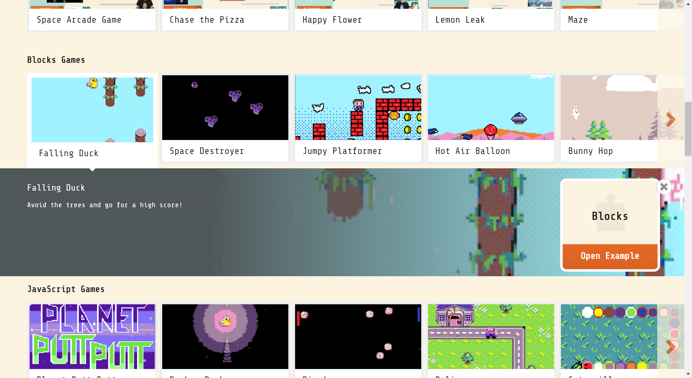
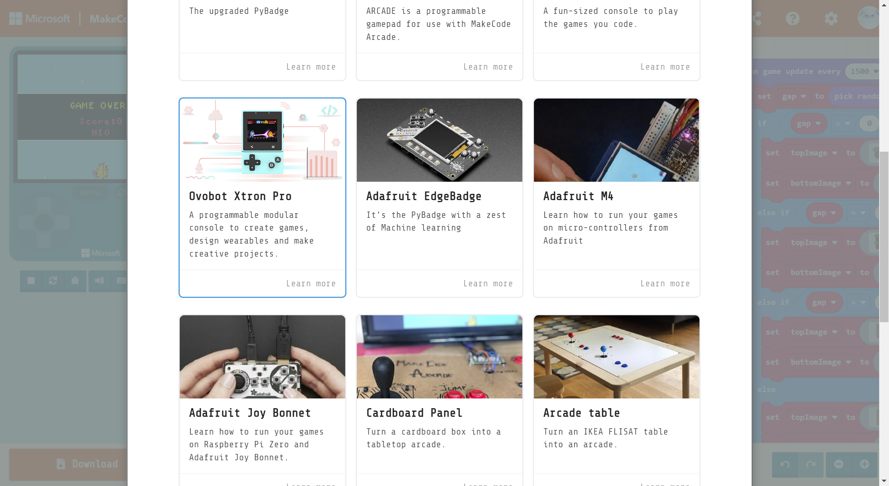
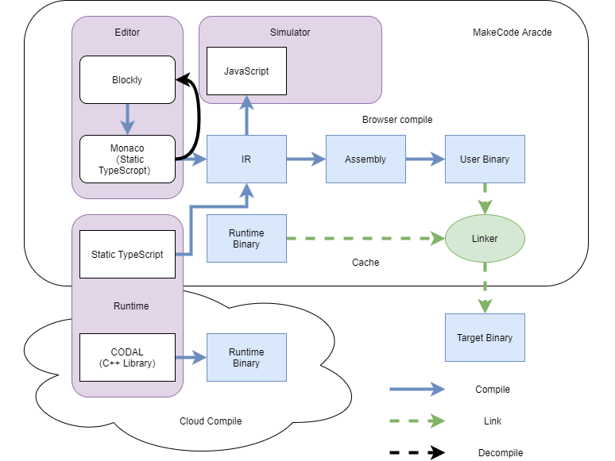

# Xtron Pro tutorial

In this tutorial you will learn the basic use of Xtron Pro, download a game from MakeCode Arcade to the device, and create a simple game yourself.

The tutorial is armed at people interested in learning how to make pixel  games and apps with MakeCode Arcade and run them on Xtron Pro. No prior experience with programming is required.

The things you will need to follow are a Xtron Pro, a web browser and an Internet connection.

## Getting started

### Preparing your Xtron Pro

To start, press the Start button of your Xtron Pro to turn it on. Xtron Pro has two program areas, the bootloader area and the user application area. You must first make sure which program is started.

### Bootloader

The bootloader is a program to load user application, in the boodloader program, you can download your games or apps to the device, and view the application list in the device storage.

The following interface is the bootloader home, where you will see our website url and button instructions, press **Select** button to enter application list interface.

In the appliction list interface, you can navigate by press "Up/Down" buttons on the gamepad or "<" button on the core, and press "A" button on the gamepad or "Menu" button on the core to run an application.

### User application

A user application is a program that you made using MakeCode Arcade. It can be a game, a watch app or other apps.

The following pictue is the screenshot of falling duck game.

### Switch between them

Press Reset button on the core to switch between the bootloader and the user app.

## Download a game

### Go to MakeCode Arcade

Go to [arcade.makecode.com](https://arcade.makecode.com) web application, scroll down to the **Blocks Games** section, select the first one - Falling Duck, then you will see a game introduction card.

Press Open Example button to enter the Editor, where you can code in the Editor, and play the game on the simulator.

Press download button to download the game, scroll down to select the Xtron Pro in the Hardware list page. Then you will get the game file on you computer.

### Connect your Xtron Pro

Now connect your Xtron Pro to your computer, and reset it to Bootloader, there will be a drive disk named XTRON on your computer.

### The default files in drive disk

The XTRON drive disk contains the following device related files defaultly that don't show in the bootloader application list:

`INFO_UF2.TXT`

> Basic information of the device, it contains the bootloader version, the model and the BOARD-ID of the device.

`CONFIG.BIN`

> The device configuration file in binary format.

`CURRENT.UF2`

> The current firmware on the device in UF2 format.

`INDEX.HTM`

> The HTML document you click will go to the MakeCode Arcade website. 

These files are genarated automatically, and can not be deleted, so keep them.

### Copy

Copy the game file to the XTRON drive disk, it will take a while to download the game to the device, the game will execute automatically after the download is complete.

Yes, the download procedure is simple like copy and paste, it not only save the game to the device internel storage, but also upgrade the flash of the MCU on the devce.

### WebUSB

In addition to copy and paste, you can also download the game via WebUSB. 

This is a new technology that allows your web browser to directly interact with connected devices over USB, meaning that you don't need to download your uf2 file before flashing it to the Xtron Pro! Also, the games are not stored in the inernal storage, when you need to repeatedly download the game to the device for testing, you can use this method.

Step 1: Click the download option button to the right of the download button to choose hardware.

Step 2: Choose Xtron Pro in the hardware list, and then click the download option button again to connet hardware.

Step3: Select Ovobot Xtron in the pop-up dialog box of the browser and click the connect button.

## Make a game

You can use Blocks, Javascipt and Python to make your games on the MakeCode Arcade, the following picture shows how your block code generate a binary firmware runs on your Xtron Pro:

You can start making a game from the tutorial or skillmap on the MakeCode Arcade homepage.

[Select a tutorial to get started](https://arcade.makecode.com/tutorials)

or

[Start from skillmaps](https://arcade.makecode.com/skillmaps)